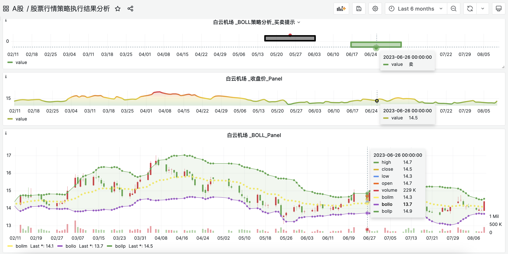
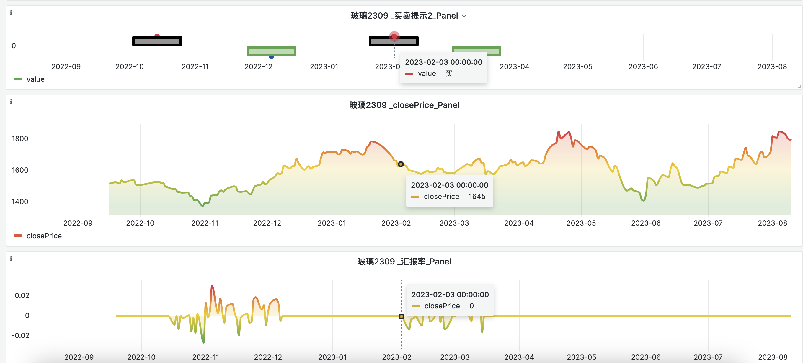
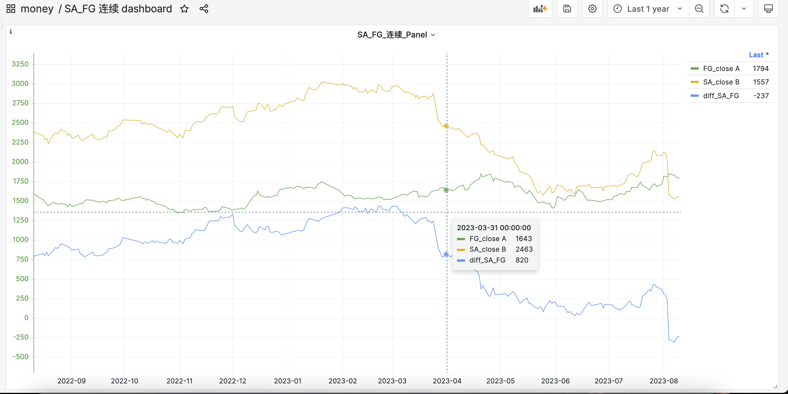

# 系统功能预览

# 1.登录 首页

参考[登录文档](login.md)

# 2. A股 行情与策略分析

## 2.1 [A股股票列表](http://mac.boxtrade.top:3000/d/4OYWlr34k/6IKh56Wo5YiX6KGo?orgId=1 "A股股票列表")

可以筛选和搜索

## 2.2 [A股行情及策略回测](http://mac.boxtrade.top:3000/d/tLUrFR64z/kline?orgId=1 "A股行情及策略回测")

### 2.2.1 行情数据提供除权和前复权，后复权数据；外链公司信息

### 2.2.2 内置策略执行结果概览

### 2.2.3 量价走势图

## 2.3 [A股策略执行结果分析](http://mac.boxtrade.top:3000/d/GjNJERe4k/6IKh56Wo6KGM5oOF562W55Wl5omn6KGM57uT5p6c5YiG5p6Q?orgId=1 "A股策略执行结果分析")

### 2.3.1 策略执行结果分析

### 2.3.2 策略执行买卖分析

### 2.3.4 策略执行买点提示

### 2.3.5 策略执行卖点提示

### 2.3.6 策略执行回报率和现金流走势

# 3. 国内期货 行情与策略分析

## 3.1 [期货品种大全](http://mac.boxtrade.top:3000/d/9TW7gm64k/5pyf6LSn5ZOB56eN5YiX6KGo?orgId=1 "期货品种大全")

### 3.1.1 可以筛选交易所和品种

### 3.1.2 筛选交易所

### 3.1.3 筛选交期货品种

## 3.2 [期货在售合约](http://mac.boxtrade.top:3000/d/83dgim64k/sku "期货在售合约")

可筛选品种 

## 3.3 [期货行情及策略回测](http://mac.boxtrade.top:3000/d/Tf-fDneVk/kline?orgId=1 "期货行情及策略回测")

### 3.3.1 行情查看 可选择 不同周期

### 3.3.2 内置策略执行结果概览

### 3.3.3 量价走势图

## 3.4 [期货策略执行结果分析](http://mac.boxtrade.top:3000/d/-2CtF7eVz/5pyf6LSn6KGM5oOF562W55Wl5omn6KGM57uT5p6c5YiG5p6Q?orgId=1 "期货策略执行结果分析")

### 3.4.1 策略执行结果分析

### 3.4.2 策略执行买卖分析

### 3.4.3 策略执行买点提示

### 3.4.4 策略执行卖点提示

### 3.4.5 策略执行回报率和现金流走势

## 3.5 [期货分时行情走势](http://mac.boxtrade.top:3000/d/85FUEQ9Vk/5pyf6LSn6KGM5oOF6LWw5Yq_?orgId=1 "期货分时行情走势")

不同周期走势图汇总

## 3.6 [期货远近合约价格走势及价差分析v3](http://mac.boxtrade.top:3000/d/w9Zkqd64z/v3?orgId=1 "期货远近合约价格走势及价差分析v3")

### 3.6.1 期货单品所有合约价格汇总

### 3.6.2 期货单品所有合约与后一期合约的价差走势

# 4. 对冲交易对

## 4.1 [纯碱玻璃合约价差走势图（周期可选）](http://mac.boxtrade.top:3000/d/hsGuJT-5k/sa-fg-day-dashboard?from=now-1y&to=now "纯碱玻璃合约价差走势图（周期可选）")

## 4.2 [纯碱玻璃连续合约价差走势日线图](http://mac.boxtrade.top:3000/d/c0k5nrPVz/sa-fg-dashboard?orgId=1 "纯碱玻璃连续合约价差走势日线图")

### 4.2.1 纯碱玻璃主力合约价格及其差走势

近期主力切换 ；数据异常

### 4.2.2 纯碱玻璃主力合约价格差走势

### 4.2.3 纯碱玻璃主力合约价格和走势

## 4.3 [纯碱玻璃价差走势分线图（主力）](http://mac.boxtrade.top:3000/d/hsGuJT-4k/sa-fg-min-dashboard?orgId=1 "纯碱玻璃价差走势分线图（主力）")

# 5. 策略

## 5.1 [策略列表](http://mac.boxtrade.top:3000/d/1ulFIXj4k/562W55Wl6KeG5Zu-?orgId=1)

# 6.建议和留言(2)

## 6.1 [建议和留言](https://txc.qq.com/products/603127 "建议和留言")

# 7. 交易交流社区(1)

## 7.1 [中新新闻](http://mac.boxtrade.top:3000/d/nIMCCoe4k/5Lit5paw5paw6Ze7?orgId=1)

## 7.2 [玻璃社区](http://mac.boxtrade.top:3000/d/DiRnHesVz/546755KD56S-5Yy6?orgId=1)

内嵌东财的社区 

# 8. A股市场特色视图

## 8.1 [大盘云图](http://mac.boxtrade.top:3000/d/YYS6URs4k/dashboard?orgId=1 "大盘云图")

## 8.2 [东方财富-市场风格](http://mac.boxtrade.top:3000/d/u7Q_-He4z/5Lic5pa56LSi5a-MLeW4guWcuumjjuagvA?orgId=1 "东方财富-市场风格")

# 9. 友链

-[工具网站导航](http://www.boxtrade.top/ "工具网站导航")

