# 经典指标策略回测一览

# 关键词

# A股市场（沪深京三市） 5000+股票20年内日线走势回测，区分除权，前复权，后复权三种模式；由于数据量较大，采用两种方式共享数据，一是 天启网站的数据表格可视化，而是 phpadmin数据管理台查看（自行SQL查询），登录方式在最下方。

--- 

# 1、天启平台 登录

网站地址 [http://mac.boxtrade.top:3000](http://mac.boxtrade.top:3000)

网站登录方式支持github,gitee码云，grafana;

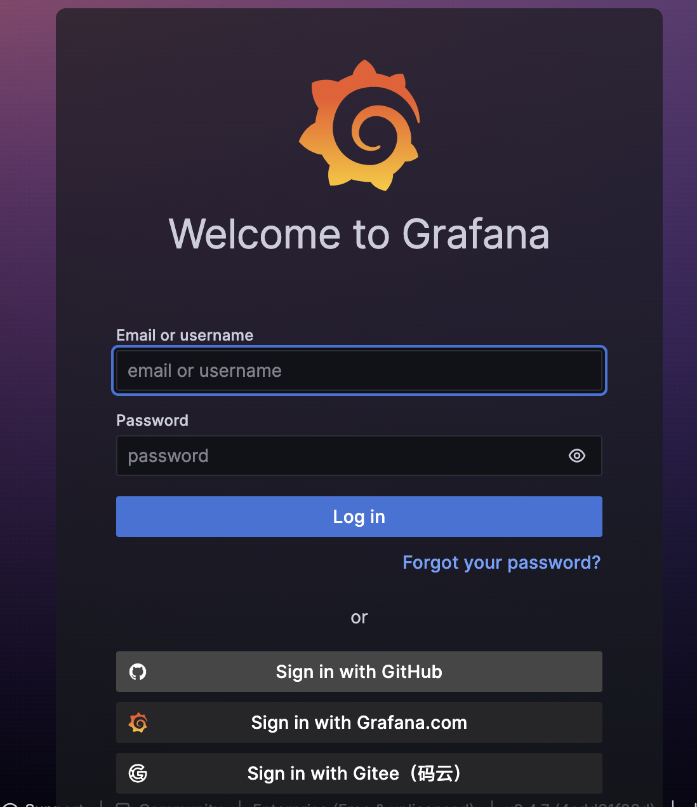

> 这里推荐用Gitee码云账号登录，也可以向 管理员申请 子账号

> [管理员联系方式](../contact.md) ;优先邮箱联系方式 [boxtrade@qq.com](mailto:boxtrade@qq.com)

# 2、首页-回测收益表-导航

- 可按收益排名回测记录

[回测收益表-总览（A股5000+）](http://mac.boxtrade.top:3000/d/d9PTgpmIk/5Zue5rWL5pS255uK6KGoLeaAu-iniA)

- 可筛选指定的标的

[回测收益表-标的搜索](http://mac.boxtrade.top:3000/d/QK1z5jmIk/5Zue5rWL5pS255uK6KGoLeagh-eahOaQnOe0og?orgId=1)

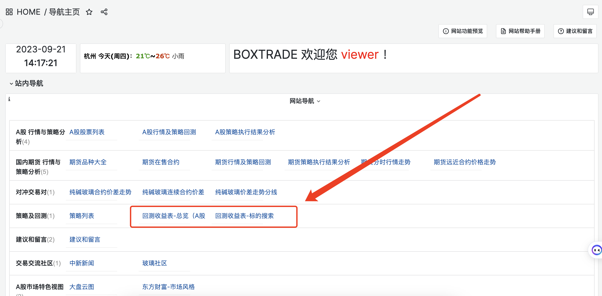

# 3、[回测收益表-总览（A股5000+）](http://mac.boxtrade.top:3000/d/d9PTgpmIk/5Zue5rWL5pS255uK6KGoLeaAu-iniA)

## 3.1 默认按总收益排行

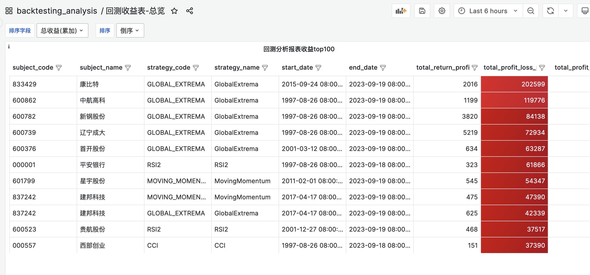

## 3.2 也可以按照以下条件筛选 经典的最大回撤，回报率，收益率，胜率，开仓次数等

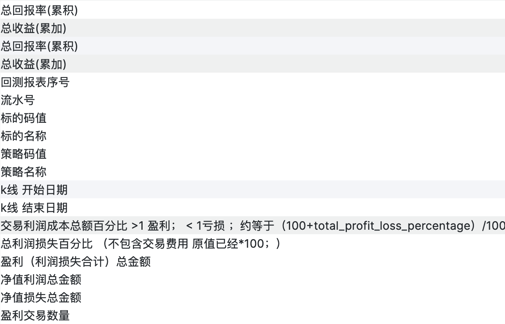

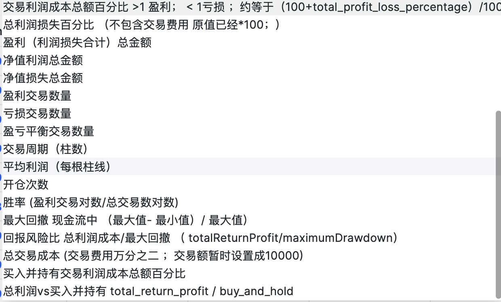

## 3.3 按回报率筛选到 华域汽车 600741

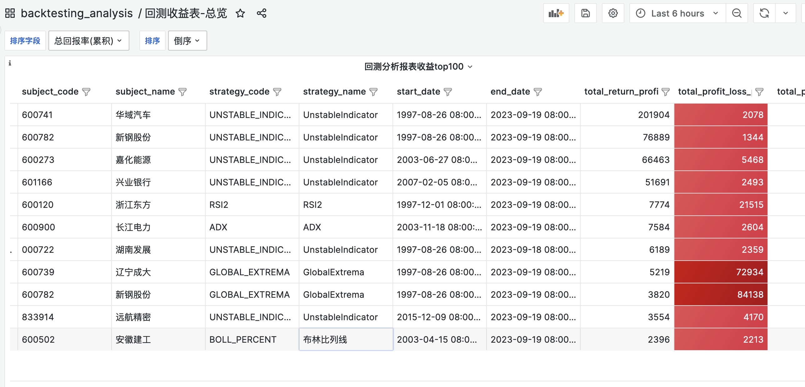

## 3.4 可筛选指定的标的查看 [回测收益表-标的搜索](http://mac.boxtrade.top:3000/d/QK1z5jmIk/5Zue5rWL5pS255uK6KGoLeagh-eahOaQnOe0og?orgId=1)

>  标的中输入 东方财富，查看东方财富的 回测报告。

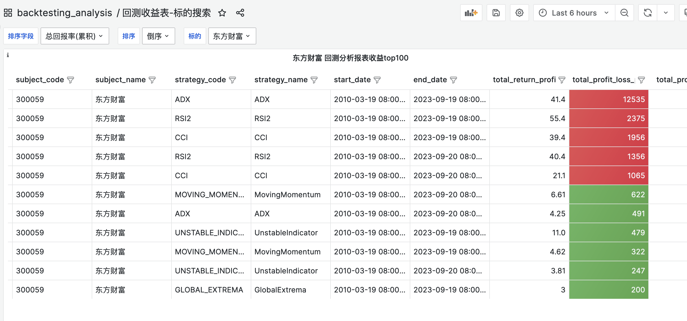

# 4、查看 回测详情

## 4.1 点击 statement_id列的链接，查看回测详情

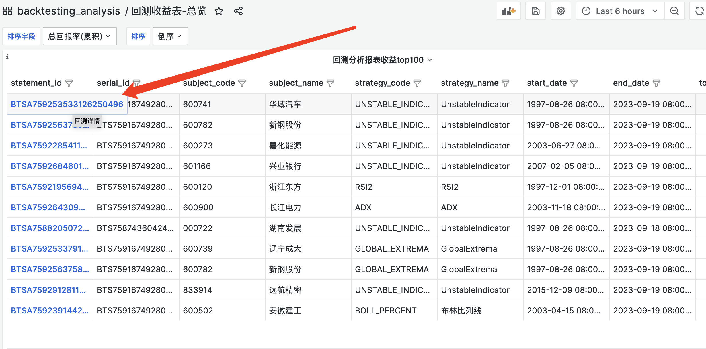

## 4.2  回测概览 最大回撤，回报率，收益率，胜率，开仓次数，风险回报率，持有VS策略

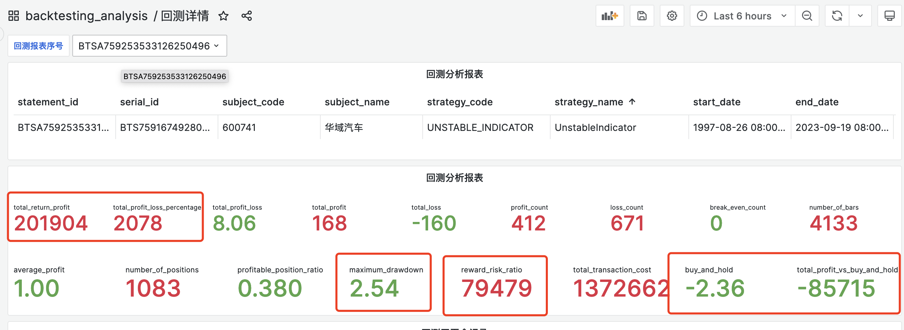

## 4.3 回测开平仓记录及交易记录

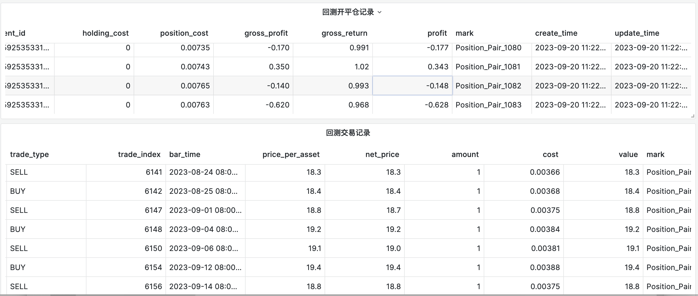

## 4.3 回测开平仓记录，交易记录，现金流，回报率，价格走势可视化图例

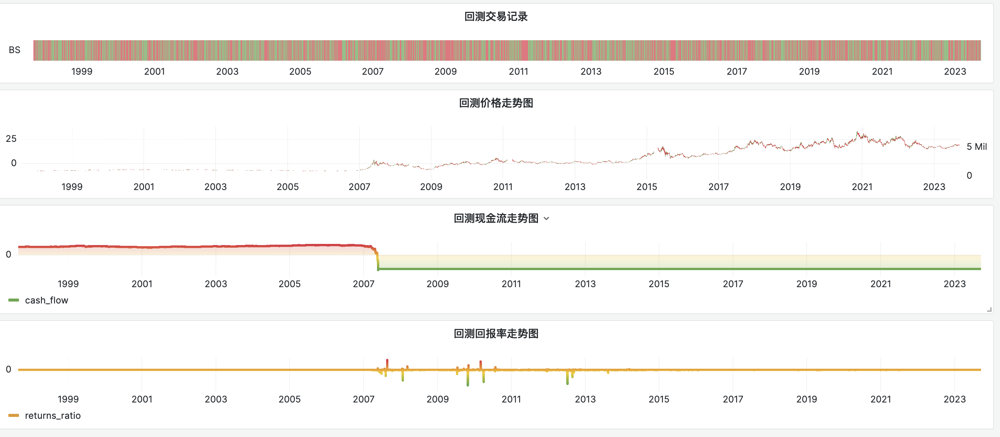

# 5、回测数据自行查看，在线web查看数据（支持SQL ）

> 可查询市场各类字典，如股票，期货，类别；及本次回次报告记录
> 
> 数据库地址和登录账户密码在以下连接

[A股20年数据回测结果mysql数据查询 phpadmin](backtesting/phpadmin_data_view.md)

# 6、赞助

感谢您对我们的项目表达出的关注和支持！我们致力于为用户提供高质量的回测数据，但由于开发和维护项目所需的时间和精力较大，以及托管服务器的持续运营成本较高，因此我们希望能够得到您的赞助，以便更好地维护和改进我们的项目。

[赞助链接](../donate/README.md)
