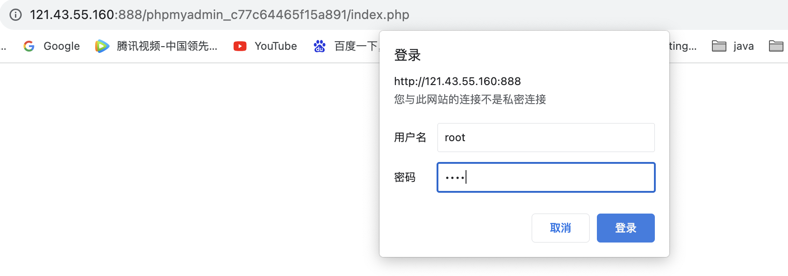
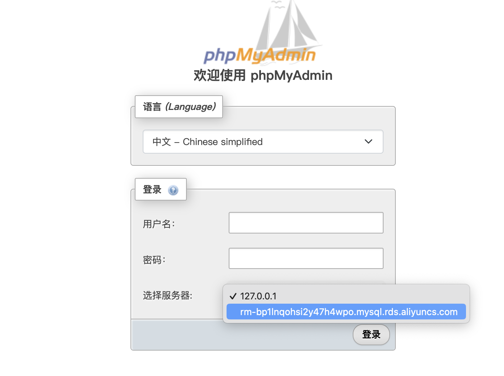
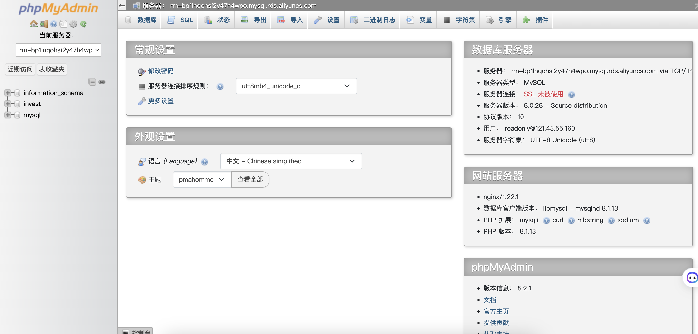
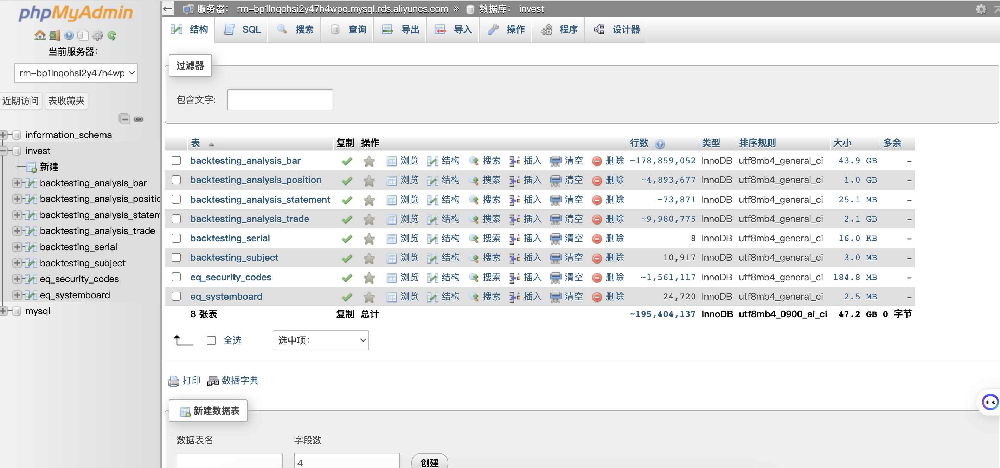

# 数据库登录使用

---

# 1.登录mysql数据库管理台 phpadmin

访问地址：  <http://121.43.55.160:888/phpmyadmin_c77c64465f15a891/index.php>

用户名：root

密码： root

# 2.切换到阿里云服务器

# 3 数据库密码

用户名：readonly 

密码：  Nbcb*12345 

到期日 2023年11月10日

# 4.数据库管理台 phpadmin 首页

# 5.业务表一览

