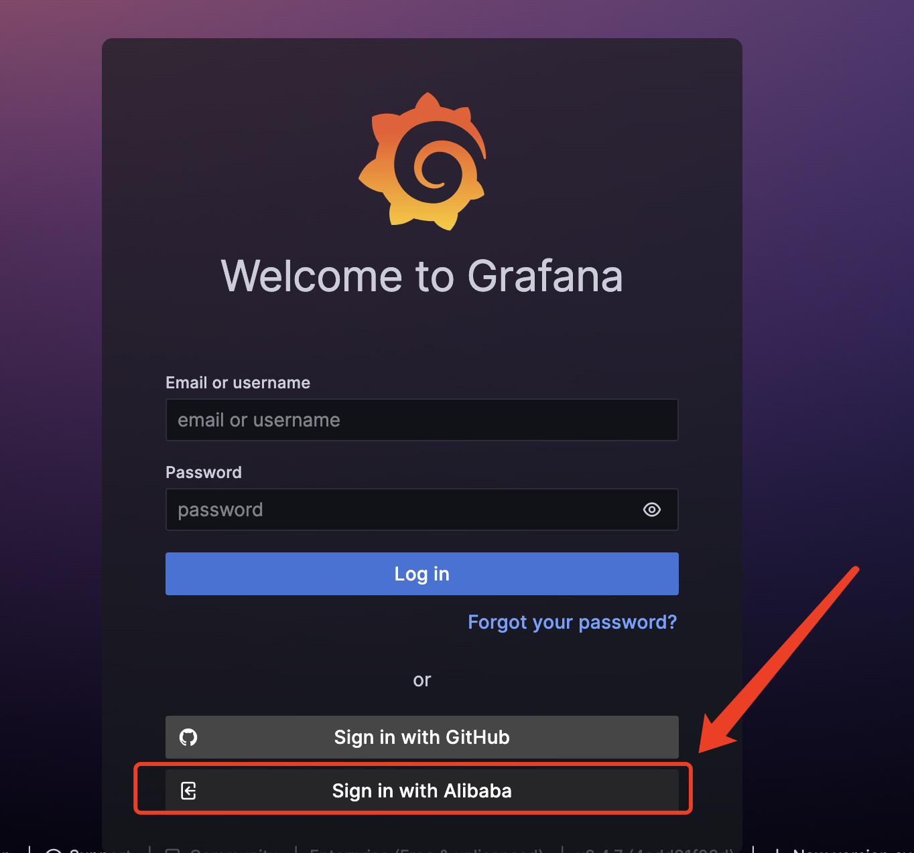
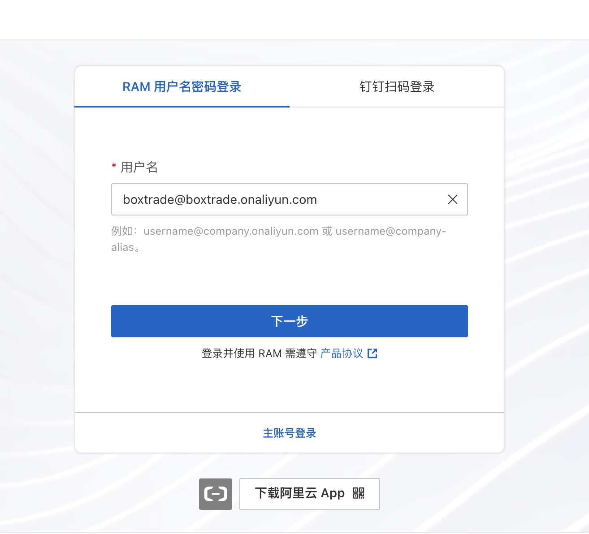
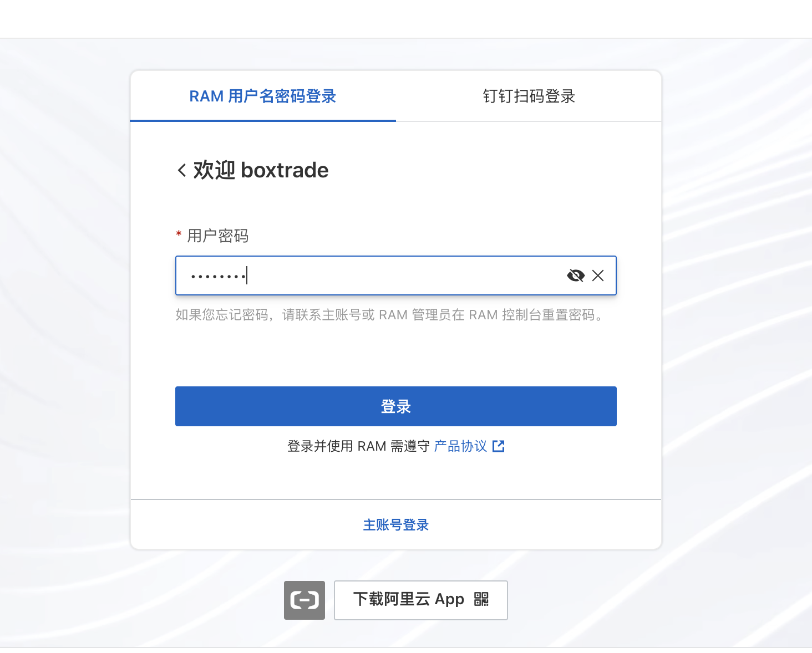
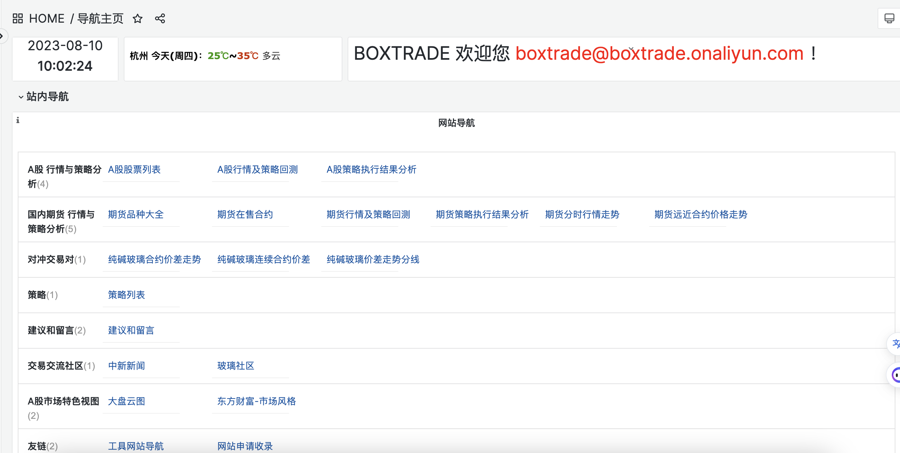

# 网站登录

网站的地址为 [http://mac.boxtrade.top:3000](http://mac.boxtrade.top:3000)

网站登录的方式有三种

- 内置账号登录

- github账号登录

- 阿里云账号登录

> 这里推荐用阿里云账号登录，也可以向 管理员申请阿里云RAM  子账号
> 
> [管理员联系方式 ](contact.md) ;优先邮箱联系方式 [boxtrade@qq.com](mailto:boxtrade@qq.com)

## 阿里云账号登录

### 1.点击登录页 Sign in with Alibaba

### 2.输入申请的用户名或钉钉扫码登录

### 3. 输入密码登录成功后自动跳转网站首页

### 4.登入主页  [http://mac.boxtrade.top:3000](http://mac.boxtrade.top:3000)

## 测试账户 参考 阿里云登录

网站地址 <http://mac.boxtrade.top:3000>

阿里云登录
账户 boxtrade@boxtrade.onaliyun.com
密码 boxtrade
