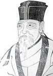

# 辨奸论

朝代：[宋朝](https://www.gushicimingju.com/shiren/songchao/)|作者：[苏洵](https://www.gushicimingju.com/shiren/suxun/)

　　事有必至，理有固然。惟天下之静者，乃能见微而知著。月晕而风，础润而雨，人人知之。人事之推移，理势之相因，其疏阔而难知，变化而不可测者，孰与天地阴阳之事。而贤者有不知，其故何也?好恶乱其中，而利害夺其外也!

　　昔者，山巨源见王衍曰：“误天下苍生者，必此人也!”郭汾阳见卢杞曰：“此人得志。吾子孙无遗类矣!”自今而言之，其理固有可见者。以吾观之，王衍之为人，容貌言语，固有以欺世而盗名者。然不忮不求，与物浮沉。使晋无惠帝，仅得中主，虽衍百千，何从而乱天下乎?卢杞之奸，固足以败国。然而不学无文，容貌不足以动人，言语不足以眩世，非德宗之鄙暗，亦何从而用之?由是言之，二公之料二子，亦容有未必然也!

　　今有人，口诵孔、老之言，身履夷、齐之行，收召好名之士、不得志之人，相与造作言语，私立名字，以为颜渊、孟轲复出，而阴贼险狠，与人异趣。是王衍、卢杞合而为一人也。其祸岂可胜言哉?夫面垢不忘洗，衣垢不忘浣。此人之至情也。今也不然，衣臣虏之衣。食犬彘之食，囚首丧面，而谈诗书，此岂其情也哉?凡事之不近人情者，鲜不为大奸慝，竖刁、易牙、开方是也。以盖世之名，而济其未形之患。虽有愿治之主，好贤之相，犹将举而用之。则其为天下患，必然而无疑者，非特二子之比也。

　　孙子曰：“善用兵者，无赫赫之功。”使斯人而不用也，则吾言为过，而斯人有不遇之叹。孰知祸之至于此哉?不然。天下将被其祸，而吾获知言之名，悲夫!

## 翻译/译文

**译文一**  
　　事情的发展必定会有一定的结局，道理有它原本就该如此的规律。天下只有表现冷静的人，才能从细微之处预见到日后将会发生的显著变化。[月亮](https://www.gushicimingju.com/gushi/yueliang/ "关于月亮的古诗")周围出现了晕圈预示着将要刮[风](https://www.gushicimingju.com/gushi/shi/1743.html)，房屋的石柱返潮湿润预示着将要[下雨](https://www.gushicimingju.com/gushi/yu/)，这是人人皆知的事。人事的发展变化，情理和形势之间的因果关系，也是空疏渺茫难以尽知，千变万化而无法预先料到的，怎么能和天地阴阳的变化相比？即便是贤能的人对此也有所不解。这是什么原因呢?这是由于喜爱和憎恨扰乱了他们的内心，利害关系又影响了他们的行动啊!  
　　从前[山](https://www.gushicimingju.com/shiju/shan/ "写山的诗句")巨源见到[王衍](https://www.gushicimingju.com/shiren/wangyan4/jianjie.html "王衍简介")，说：“将来给天下百姓带来灾难的，一定是这个人!”郭汾阳见到卢杞，说：“这个人一旦得志，我的子孙就会被他杀得一个不留!”现在分析一下他们所说的话。其中的道理是可以料想到的。依我看来，[王衍](https://www.gushicimingju.com/shiren/wangyan4/gushi.html "王衍的故事")之为人，从容貌和谈吐上，确实具备了欺世盗名的条件。但是他不妒忌别人，不贪图钱财，只是随大流。如果晋朝当时没有惠帝这个昏君，当政者即使只是一个中等的君主，就算是有成百上千个王衍这样的人，又怎能扰乱天下呢?卢杞那样的奸诈，确实足以败坏[国家](https://www.gushicimingju.com/tag/500.html "关于国家的诗句古诗")。但是他不学无术，容貌不足以动人，言谈不足以蒙蔽社会，如果不是遇到德宗这样的鄙陋昏庸的君主，又怎能受到重用呢?由此说来，山、郭二公对王、卢二人所作的预言，也未必完全如此啊!  
　　现在有人嘴里背诵着[孔子](https://www.gushicimingju.com/shiren/kongzi/jianjie.html "孔子简介")、[老子](https://www.gushicimingju.com/shiren/laozi/)的话，亲身实践着[伯夷](https://www.gushicimingju.com/shiren/boyi/)、叔齐的行为，收罗了一批追求名声和不得志的士人，相互制造舆论，私下里互相标榜，以为自己是颜渊、孟轲再世，然而他们为人阴险狠毒，和一般人的志趣不同。这是把王衍和卢杞合成一个人了。他在社会上酿造的祸害还能说得完吗?脸面脏了不忘洗脸，衣服脏了不忘洗衣，这本是人之常情。现在他却不是这样，身穿奴仆的衣服，吃猪狗的[食物](https://www.gushicimingju.com/tag/237.html "关于食物的诗句古诗")，头发蓬乱得像囚犯，表情哭丧着像家里有人去世，却在那里大谈《[诗](https://www.gushicimingju.com/)》《书》，这难道说是人的真实的心情吗?凡是办事不近人情的，很少不成为大奸大恶之辈，竖刁、易牙、开方就是这样的人。此人借助当世享有盛名之力，来促成他尚未形成气候的祸患。虽然有励精图治的君主，敬重贤才的宰相，也还是会选拔并重用他的。这样，他将成为天下的祸患，是必定无疑的了，这就不只是王、卢二人所能比拟的。  
　　孙子说：“善于用兵的人，并没有显赫的功勋。”如果这个人没有被重用，那么我的话就有些过头了，而此人就会有怀才不遇的感慨。谁又能知道祸患会达到上述这种地步呢?不然的话，天下将要蒙受他的祸害，而我也会获取卓有远见的名声，那就太可悲了!

**译文二**  
　　事情的发展有必然如此的原因，情理有原本如此的根源。只有天下最冷静的有修养的人，才能从细微的变化中预知发展的结果。[月亮](https://www.gushicimingju.com/shiju/yueliang/ "描写月亮的诗句")周围起晕，将要刮[风](https://www.gushicimingju.com/gushi/feng/ "描写风的古诗")，屋柱石础返潮，将要下[雨](https://www.gushicimingju.com/shiju/yu/ "关于雨的诗句")，这是人人皆知的事情。人世间事情的发展变化，道理情势的相互因循，其空疏难知、变化莫测的程度，怎能与天地阴阳之事相比呢？而贤能的人也有不知道的，那是什么缘故呢？是爱憎的感情扰乱了他们的思想，利害得失的考虑影响了他们的行为。  
　　从前，山巨源见到王衍后，就说：“将来贻害天下百姓的，一定是这个人。”[郭子仪](https://www.gushicimingju.com/shiren/guoziyi/gushi.html "郭子仪的故事")见到卢杞后，就说：“这个人如果得志，我的子孙就会一个也留不下来。”从今天的情况分析起来，那道理确实是可以预见的。依我看来，王衍这个人，容貌言语方面，确实有欺世盗名的地方，然而，他不忌[恨别](https://www.gushicimingju.com/gushi/shi/1455.html)人，不妄求，只是随波逐流，假使晋朝当时没有惠帝这个呆子，哪怕仅是一个一般的君主，即使有千百个像王衍这样的人，又怎么能把天下搞乱呢？卢杞的奸险，固然足以败坏国家，但是他不学无术，容貌不足以动人，言谈不足以欺世，如果不是遇到鄙陋昏庸的唐德宗，又怎么会得到重用呢？由此说来，山、郭二公对王、卢二人的预言，或许也未必一定如此。  
　　现在有个人，口中说着[孔子](https://www.gushicimingju.com/shiren/kongzi/)、[老子](https://www.gushicimingju.com/shiren/laozi/shiju/ "老子的诗句")的话，亲身实践着伯夷、叔齐的行为，招纳一些沽名钓誉之士和不得志的人，共同制造舆论、自我标榜，（把自己）说成是颜渊再世孟轲复生，实际上却居心叵测，阴险狠毒，与一般人的志趣不同。这人是把王衍、卢杞合于一身了，他造成的祸害难道可以用语言形容吗？面孔脏了不忘洗脸，衣服脏了不忘洗衣服，这是人之常情。现在（这个人）却不是这样，穿奴仆穿的衣服，吃猪狗吃的食物，头发蓬乱像囚徒一样，满面灰尘像居丧一样，却大谈诗书，这难道是他的真性情吗？凡是做事不近人情的人，很少不成为大奸大恶的，竖刁、易牙、开方就是这样的人。用盖世的好名声，来促成他尚未形成的祸患，虽然有想把国家治好的君主，爱好贤才的宰相，还是会举荐他，任用他的。那么他成为天下的祸患，将是必然而没有疑问的，这就不只是王、卢二人所能比得上的了。  
　　孙子说：“善于用兵的人，并无显赫的功勋。”假使这人不被重用，那么我的话就说错了，而这个人会有怀才不遇的感叹。谁能知道祸患将会到这样严重的地步呢？假使不是这样的，（他受到了重用）天下将要遭受到他的祸害，而我会获得能见微知著、察言识人的美名，那就太可悲了。

**注释**  
①静者：指能够冷静地观察周围事物而做出合理结论的贤人。  
②天地阴阳之事：指[自然](https://www.gushicimingju.com/tag/353.html "关于自然的诗句古诗")现象。古人认为自然界有阴阳二气，二气交互发生作用，便产生了形形色色的自然变化。  
③贤者：旧说以为是影射[欧阳修](https://www.gushicimingju.com/shiren/ouyangxiu/shiju/ "欧阳修的诗句")。据史书记载，[曾巩](https://www.gushicimingju.com/shiren/zenggong/jianjie.html "曾巩简介")曾向[欧阳修](https://www.gushicimingju.com/shiren/ouyangxiu/)推荐[王安石](https://www.gushicimingju.com/shiren/wanganshi/shiju/ "王安石的诗句")的[文章](https://www.gushicimingju.com/tag/309.html "关于文章的诗句古诗")，[欧阳修](https://www.gushicimingju.com/shiren/ouyangxiu/gushi.html "欧阳修的故事")大加赞赏，并帮助[王安石](https://www.gushicimingju.com/shiren/wanganshi/ "王安石的诗")考取了进士。  
④山巨源：[山涛](https://www.gushicimingju.com/shiren/shantao/)（205—283），字巨源，晋初人，任吏部[尚书](https://www.gushicimingju.com/dianji/shangshu/)，为当时的“[竹林七贤](https://www.gushicimingju.com/shiren/zhulinqixian/)”之一。他喜好评论人物，对王衍的评价不高。王衍（256—311）：字夷甫，晋初人，任尚书令、太尉。衍有盛才，常自比子贡。当时晋室诸王擅权，他周旋于诸王间，唯求自全之计，后死于战乱之中。  
⑤郭汾阳：即[郭子仪](https://www.gushicimingju.com/shiren/guoziyi/jianjie.html "郭子仪简介")（697—781），唐华州（今属陕西）人，累官至太尉、中书令，曾平定安史之乱，破吐蕃，以一身系国家安危者二十年，后封为汾阳郡王，世称郭汾阳。卢杞：字子良，唐滑州（今河南滑县一带）人，唐德宗时任宰相，搜刮民财，排斥异己。杞相貌丑陋，好口辩。后被贬职死于外地。  
⑥忮（zhì）：嫉恨。  
⑦惠帝：晋惠帝（290—306在位），晋开国君主司[马](https://www.gushicimingju.com/gushi/shi/222.html)炎之子，以痴呆闻名。他在位时不理朝政，大权旁落，终导致“八王之乱”，晋室随之衰败。  
⑧眩（xuàn）：通“炫”，惑乱。  
⑨德宗：唐德宗（780—805在位），唐代晚期的庸君，他削去郭子仪的兵权，重用卢杞，导致朝政紊乱。

## 赏析/鉴赏

　　把《辨奸论》全文连贯起来看，在写作目的上，作者确有所指，而所指的具体人物，作者又未点明。我们也没有必要进行烦琐考证。仅就立意谋篇上来说，本文确属古文中的名篇。

　　作者提出的“见微知著”的观点是有一定道理的。不要轻视小事情，大事情都是由小事情积累而成的。“防微杜渐”早就是古人奉为圭臬的名言。正如清人吴楚材所说：“见微知著，可为千古观人之法。”

　　本文突出的成功之处在于谋篇。文章开始先将天象和人事进行比较，指出了人事比天象更难掌握，并说明这是由于“好恶”和“利害”所形成的必然结果。言之有理，持之有故，不能不令人首肯。接着，又通过历史上山涛、郭子仪对王衍、卢杞的评论，说明了山、郭二人的评论虽有一定道理，但也有所疏漏，这就为下文的“今有人”起了铺垫作用。本文的第三段是作者倾注全力发泄的部分，将“今有人”的种种表现尽情地加以刻[画](https://www.gushicimingju.com/gushi/shi/192.html)，一气呵成，有如飞瀑狂泄，其笔锋之犀利，论证之严谨，不能不令人叹为观止。而在结尾处，作者又留有余地地提出两种可能出现的情况，这就使人感到作者所持的公允的态度。

　　作者在批评“有的人”时，把[生活](https://www.gushicimingju.com/tag/329.html "关于生活的诗句古诗")习惯（如不修边幅）也作为攻击的口实，未免失之偏颇了。但是，这点微疵并不足以影响本文的成就。

　　《辨奸论》旨在诋毁[王安石](https://www.gushicimingju.com/shiren/wanganshi/jianjie.html "王安石简介")，竭力反对“新党”，抛开其本旨，有二点与当今相类：

　　其一，作者谓王安石“口诵孔老之书，身履夷齐之行，收召好名之士、不得志之人，相与造作语言，私立名字，以为颜渊、孟轲复出，而阴贼险狠，与人异趣。是王衍、卢杞合而为一人也，其祸岂可胜言哉？”王安石是否如此，且不论。但阴贼险狠如王卢之合一，代有其人，今也不鲜，这是此论给予后人的启迪之一，须警惕而“辨”。否则，其祸轻则杀身，重则祸国殃民。

　　其二，作者提到一种“不近人情”的现象：“衣臣虏之衣，食犬彘之食，囚首丧面，而谈诗书，此岂其情也哉？”然而这一看来违反常情的情况，在1957年夏之后以及“文革”中，屡见于囹圄。这是悲剧，当然，古人是无从预料这种悲剧的。

　　1069年，王安石开始推行新法，遭到保守人士的反对。保守派为打击王安石，传出了这篇文章，并署名为已死去的[苏洵](https://www.gushicimingju.com/shiren/suxun/jianjie.html "苏洵简介")，借以闲适作者早在王安石变法之前就“见微知著”，预见到他得志必为奸。《辨奸论》是否是[苏洵](https://www.gushicimingju.com/shiren/suxun/)所作，学术界有不同的观点。文章先抬出“事有必至，理有固然”，万事均可“见微而知著”，预测规律，作为理论基础。然后以山巨源预见王衍、郭子仪预见

卢杞为例证，类比王安石“衣臣虏之衣，食犬彘之食，囚首丧面而谈诗书”的行为”不近人情“，进而推导出王安石得志必为奸臣、为害国家的结论。这种以人的生活习惯和个别缺点来判断其政治品质的逻辑，是非常错误的。这种影射咒骂、攻击人身的写作手段也是非常低劣的。  

## [苏洵简介](https://www.gushicimingju.com/shiren/suxun/jianjie.html)

苏洵（1009年5[月](https://www.gushicimingju.com/gushi/shi/1344.html)22日—1066年5月21日），字明允，自号老泉，汉族，眉州眉山（今属四川眉山）人。北宋文学家，与其子[苏轼](https://www.gushicimingju.com/shiren/sushi/jianjie.html "苏轼简介")、[苏辙](https://www.gushicimingju.com/shiren/suzhe/jianjie.html "苏辙简介")并以文学著称于世，世称“[三苏](https://www.gushicimingju.com/shiren/sansu/)”，均被列入“[唐宋八大家](https://www.gushicimingju.com/shiren/tangsongbadajia/)”。 苏洵擅长于散文，尤其擅长政论，议论明畅，笔势雄健，著有《嘉祐集》二十卷，及《谥法》三卷，均与《[宋史](https://www.gushicimingju.com/dianji/songshi/)本传》并传于世。
